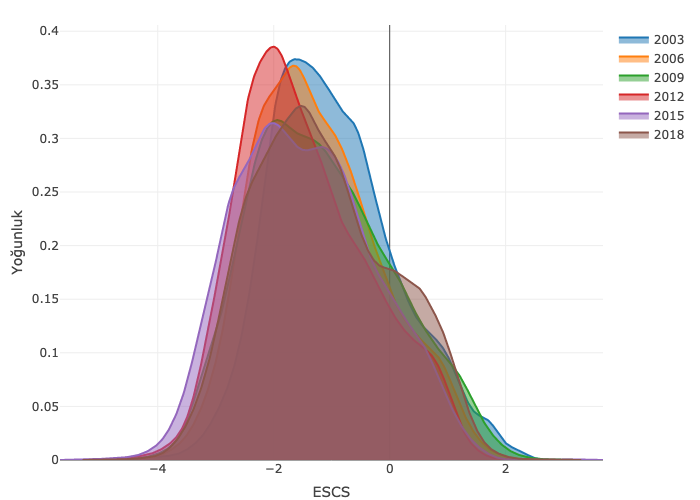

<!-- options(download.file.method="libcurl") -->

```{r setup, include=FALSE}
knitr::opts_chunk$set(
	echo = TRUE,
	message = FALSE,
	warning = FALSE
)
options(digits=3)
library(dplyr)
library(tidyverse)
library(dplyr)
library(tuev)
library(emo)
library(knitr)

```


<br>
<br>
.center[

##  `r fontawesome::fa(name = "handshake")`: Kübra Atalay Kabasakal
<br>
--
<br>

##  `r emo::ji("mail")`: [katalay@hacettepe.edu.tr](https://avesis.hacettepe.edu.tr/katalay)
<br>
--
<br>
]

---
## Problem Durumu

---
## Yöntem

---
## Bulgular

```{r echo=FALSE, fig.align='center',out.width="60%"}

```

---
.center[
<br>
<br>
<br>

.hand[Teşekkürler]

`r emo::ji("thanks")`
 
]


