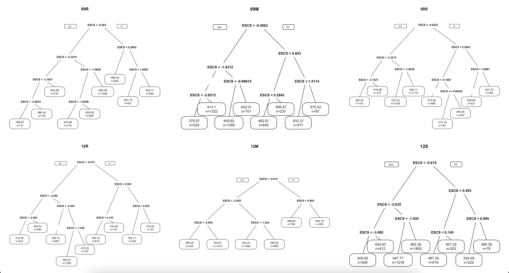

```{r include=FALSE}
source("ESCS-ACHgraf_3.R", echo=TRUE, local = knitr::knit_global())


```


##  `r fontawesome::fa(name = "handshake")`: Mehmet Can Demir
##  `r emo::ji("mail")`: mehmetdemir@bartin.edu.tr
----
##  `r fontawesome::fa(name = "handshake")`: Kübra Atalay Kabasakal
##  `r emo::ji("mail")`: katalay@hacettepe.edu.tr
----
##  `r fontawesome::fa(name = "handshake")`: Murat Doğan Şahin
##  `r emo::ji("mail")`: mdsahin@anadolu.edu.tr


---
## Problem Durumu

- Uluslararası Öğrenci Değerlendirme Programı (Programme for International Student Assessment / PISA) ile okuma, matematik ve fen alanlarına ilişkin başarı testleri ve başarıyı etkilediği düşünülen değişkenlerle ilgili anketler aracılığıyla 60’tan fazla ülkeden 15 yaş grubundaki yaklaşık 500.000 öğrenciden üç yılda bir veri toplanmaktadır. 

--

- Yapılan çalışmalar neticesinde, **sosyoekonomik düzeyin eğitim başarısının önemli yordayıcılarından biri** olduğu sonucuna ulaşılmıştır (Erdem & Kaya, 2021; Gamazo & Martínez-Abad, 2020). 


---
## Problem Durumu

- **Sosyoekonomik düzey yükseldikçe eğitim başarısı artmaktadır.**

--


- Ancak, ilişkinin yönü değişmese dahi, ilişkinin büyüklüğü değişkenlerin tüm düzeyleri için aynı olmayabilir; **sosyoekonomik düzeyin eğitim başarısını yordama gücü, sosyoekonomik düzeyin farklı düzeylerinde eşit olmayabilir.**

---
## Araştırmanın Amacı

- Bu araştırmanın amacı, 2003-2019 yılları arasındaki PISA Türkiye verilerindeki farklı sosyoekonomik düzeylerde, **sosyoekonomik düzey ile başarı puanları arasındaki ilişkiyi incelemektir.**

---
## Yöntem

- Bu araştırma, var olan bir durumun betimlenmesi amacıyla yürütüldüğü için betimsel araştırma modelindedir (Fraenkel, Wallen & Hyun, 2012). 

--

- Araştırmada, 2003-2019 yılları arasında yer alan altı PISA döngüsünde Türkiye örneklemine ilişkin veriler kullanılmıştır. 

---
## Yöntem

- Okuma, fen ve matematik alanlarına ilişkin başarı puanı olarak, her döngüde ilgili alt alan için hesaplanan **makul değerlerin (plausible value) ortalaması** ve **sosyoekonomik düzey** için PISA tarafından hesaplanan “Ekonomik, Sosyal ve Kültürel Durum” (ESCS) değişkeni kullanılmıştır.

--

- ESCS ebeveynlerin eğitim durumu, ebeveynlerin mesleki durumu ve evde bulunan eşyalar (kitap, ülkeye özgü zenginlik ölçütü, vb.) kullanılarak hesaplanan bir indeks değişkendir (OECD, 2019). 

---
## Yöntem

- Veri analizi sürecinde ilk olarak, 2003-2019 yılları arasındaki PISA Türkiye verileri **Sınıflama ve Regresyon Ağaçları** (Classification and Regression Trees / CART) algoritması (Breiman, Friedman, Olsen & Stone, 1984) kullanılarak sosyoekonomik düzeyin herhangi bir değeri için okuma, fen ve matematik başarı puanları arasında anlamlı bir farkın olup olmadığı ve hangi değerler için fark olduğu tespit edilmiştir. 

--

- Belirlenen kesme değerler kullanılarak sosyoekonomik düzeye göre alt ve üst gruplar belirlenmiştir. 

--

- Daha sonra, döngülerde yer alan her bir alt alan için düşük ve yüksek sosyoekonomik gruplarındaki sosyoekonomik düzey-başarı puanı ilişkisi basit doğrusal regresyon analizi kullanılarak incelenmiştir. 

---
## Yöntem

- Veri analizi R yazılımında (R Core Team, 2022) yer alan **rpart** (Therneau, Atkinson, & Ripley, 2013) ve **rattle** (Williams, 2011) paketleri ile yürütülmüştür.

---
## Bulgular


```{r echo=FALSE, fig.align='center',out.width="120%"}

```


---
| Yıl | Ders |	Kesme Değeri	| ESCS |	n |	Yıl |	Ders |	Kesme Değeri |	ESCS	| n |
|---|---|---|---|---|---|---|---|---|---|
| 2003|Fen|,19|Düşük|4092|2012|Fen|-,62|Düşük|3689 | 
| 2003|Fen||Yüksek|753|2012|Fen||Yüksek|1117 | 
| 2003|Matematik|,19|Düşük|4092|2012|Matematik|-,62|Düşük|3689 | 
| 2003|Matematik||Yüksek|753|2012|Matematik||Yüksek|1117 | 
| 2003|Okuma|-,31|Düşük|3597|2012|Okuma|-,62|Düşük|3689 | 
| 2003|Okuma||Yüksek|1248|2012|Okuma||Yüksek|1117 | 
| 2006|Fen|-,57|Düşük|3643|2015|Fen|-,50|Düşük|4587 | 
| 2006|Fen||Yüksek|1291|2015|Fen||Yüksek|1277 | 
| 2006|Matematik|-,54|Düşük|3678|2015|Matematik|-,35|Düşük|4764 | 
| 2006|Matematik||Yüksek|1256|2015|Matematik||Yüksek|1095 | 
| 2006|Okuma|-,57|Düşük|3643|2015|Okuma|-,52|Düşük|4557 | 
| 2006|Okuma||Yüksek|1291|2015|Okuma||Yüksek|1302 | 

---

| Yıl | Ders |	Kesme Değeri	| ESCS |	n |	Yıl |	Ders |	Kesme Değeri |	ESCS	| n |
|---|---|---|---|---|---|---|---|---|---|
| 2009|Fen|-,62|Düşük|3389|2018|Fen|-,15|Düşük|5348| 
| 2009|Fen||Yüksek|1578|2018|Fen||Yüksek|1507 | 
| 2009|Matematik|-,41|Düşük|3647|2018|Matematik|,05|Düşük|5593| 
| 2009|Matematik||Yüksek|1320|2018|Matematik||Yüksek|1262| 
| 2009|Okuma|-,56|Düşük|3460|2018|Okuma|-,07|Düşük|5437| 
| 2009|Okuma||Yüksek|1507|2018|Okuma||Yüksek|1418| 

---
## Bulgular

```{r echo=FALSE, fig.align='center', out.width="90%"}
PV_plotlyFEN

```

---
## Bulgular

```{r echo=FALSE, fig.align='center',out.width="90%"}
PV_plotlyMAT

```


---
## Bulgular

```{r echo=FALSE, fig.align='center',out.width="90%"}
PV_plotlyOKUMA

```


---
## Bulgular

```{r echo=FALSE, fig.align='center',out.width="90%"}
ESCS_plotly
```


---
## Bulgular

```{r echo=FALSE, fig.align='center'}
ESCS_PV
```


---
## Kaynaklar
- Breiman, L., Friedman, J. H., Olshen, R. A., & Stone C. J. (1984). Classification and Regression Trees. CRC Press.
- Erdem, C., & Kaya, M. (2021). Socioeconomic status and wellbeing as predictors of students’ academic achievement: evidence from a developing country. Journal of Psychologists and Counsellors in Schools, 1-19. https://doi.org/10.1017/jgc.2021.10 
- Fraenkel, J. R., Wallen, N. E., & Hyun, H. H. (2012). How to design and evaluate research in education. McGraw-Hill.
- Gamazo, A., & Martínez-Abad, F. (2020). An Exploration of Factors Linked to Academic Performance in PISA 2018 Through Data Mining Techniques. Frontiers in Psychology, 11:575167. https://doi.org/10.3389/fpsyg.2020.575167 

---
## Kaynaklar
- OECD (2019). PISA 2018 Results (Volume I): What Students Know and Can Do, PISA, OECD Publishing, Paris, https://doi.org/10.1787/5f07c754-en. 
- OECD (2019). PISA 2018 Results (Volume III): What School Life Means for Students’ Lives, PISA, OECD Publishing, Paris, https://doi.org/10.1787/acd78851-en.
- R Core Team (2022). R: A language and environment for statistical computing. R Foundation for Statistical Computing, Vienna, Austria. https://www.R-project.org/ 
-  Therneau, T., Atkinson, B., & Ripley, B. (2013). Rpart: Recursive Partitioning. R Package Version 4.1-3. http://CRAN.R-project.org/package=rpart 
- Williams, G. J. (2011). Data Mining with Rattle and R: The art of excavating data for knowledge discovery, series Use R! Springer. https://rd.springer.com/book/10.1007/978-1-4419-9890-3 


---
.center[
<br>
<br>
<br>

.hand[Teşekkürler]

`r emo::ji("smile")`
 
]

